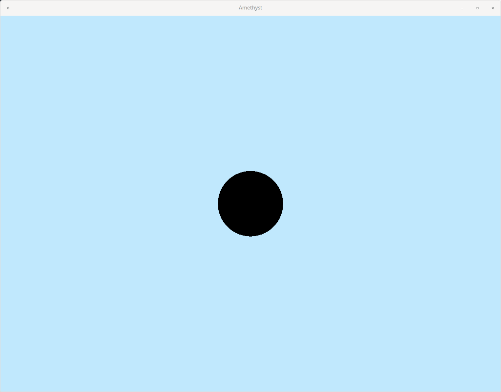

# Drawing something on the screen

Alright, I think we're ready to try *actually drawing* something on the screen.

We're going to be using [Physically based rendering](https://en.wikipedia.org/wiki/Physically_based_rendering) (PBR) for this game. It's pretty standard, and what other 3D engines (Unreal, Unity, Blender, etc) use to render stuff.

In PBR, you need three things at minimum to draw stuff:

 - A camera to view the world from
 - Some objects to render
 - A light source (*technically* you don't need this, but everything will be 100% black if you don't)

So, let's just go in that order. All three of these things will be represented by standard **entities**, with various different **components** attached to them.

## Setup

Before we can set any of those things up, though, we need some place in our code to actually *initialize* those objects, so that Amethyst's ECS framework knows about them.

Amethyst states [have a few different methods](https://docs.rs/amethyst/0.8.0/amethyst/trait.State.html) that run at different times and different intervals during the lifecycle of the state. Since we are forced to create an initial state to create an `Application`, we might as well use one of these methods to do the initialization work in.

Since we only need to initialize our three entities once per game, the `on_start` method seems like a good place to do this. `on_start` runs only once when we enter that state, which is exactly what we need.

```rust
// (other includes)
use amethyst::StateData;
use amethyst::GameData;

struct GameState;
impl SimpleState for GameState {
    fn on_start(&mut self, state_data: StateData<'_, GameData<'_, '_>>) {
        // More code will go here
    }
}

fn main() -> amethyst::Result<()> {
    // (...)
}
```

When Amethyst calls `on_start` (or any of the other methods), it passes in some "state data" that you can use for context into the rest of the game (see [StateData](https://docs.rs/amethyst/0.8.0/amethyst/struct.StateData.html)). We don't really care about the lifetimes of the references inside the `StateData` for now, so we just use `'_` to tell Rust "whatever you give us is fine with us".

Since we will ultimately want to create entities within our game (to create our camera, lights, and spaceship), we are mostly concerned with the `world` field within `StateData`; this is the same `world` that I mentioned at the end of the last chapter.

## Creating a camera

The first step is to create a camera, which allows us to see all the objects we crate in our game.

To do this, we're going to use the `Camera` module from `renderer`.

Let's make a brand new function called `initialize_camera`:

```rust
// (other includes)
use amethyst::prelude::World;
use amethyst::renderer::Camera;

// (GameState)
// (fn main)

fn initialize_camera(world: &mut World) {
    world.create_entity()
        .with(Camera::standard_3d(1024.0, 768.0))
        .build();
}
```

Since we're making a 3D game, we're going to use `standard_3d`.

`1024.0` and `768.0` are just the dimensions of our window, which we defined in our `DisplayConfig`. You can refactor that into some constants if you like; I'll do some refactoring in an upcoming chapter.

The camera follows our standard **entity** and **component** setup I mentioned earlier:

 - Create a nameless entity in our game world with `world.create_entity()`
 - Add components to the entity; in this case, we're creating a `Camera` component and attaching it to this entity
 - Build the entity to finalize everything and actually add it to the world

So the camera is *basically* the same as any other entity/component you're going to make in your game; the only difference is that `Camera` does some magic rendering-related stuff in the background.

Now, we need to hook that function up to our `on_start` method that we defined earlier:

```rust
fn on_start(&mut self, state_data: StateData<'_, GameData<'_, '_>>) {
    initialize_camera(state_data.world);
}
```

If you `cargo run` that right now, you won't notice any difference. That's because we don't have any shapes for the camera to view! Let's make one now.

## Creating an object to render

For now, we're just going to create a sphere so we understand what's going on. We'll modify it later to create the actual things in our game, like the spaceship and the cubes.

Like the camera, the sphere is also going to be a standard entity with components. Let's just follow the same pattern as we did with the camera to create it.

Create a new function called `initialize_sphere`:

```rust
fn initialize_sphere(world: &mut World) {
    world.create_entity()
        .with( /*???*/ )
        .build();
}
```

Call this function in `on_start`:

```rust
fn on_start(&mut self, state_data: StateData<'_, GameData<'_, '_>>) {
    initialize_camera(state_data.world);
    initialize_sphere(state_data.world);
}
```

Now we need to figure out how to give the sphere a "shape" to be rendered. In PBR, we need two things for our object to be renderable:

 - A **mesh**, which gives our object a shape in 3D space
 - A **material**, which tells the rendering engine how to actually render that shape.

In the next chapter I'll dive into these things with much more detail, but for now I'll just throw a blob of code at you.

#### Mesh

```rust
let mesh = world.exec(|loader: AssetLoaderSystemData<'_, Mesh>| {
    loader.load_from_data(
        Shape::Sphere(100, 100)
            .generate::<(Vec<Position>, Vec<Normal>, Vec<Tangent>, Vec<TexCoord>)>(None)
            .into(),
        (),
    )
});
```

Here we're generating the sphere mesh with `Shape::Sphere(100, 100)`. There are [a few basic shape generators to choose from](https://docs.amethyst.rs/stable/amethyst_rendy/shape/enum.Shape.html), in case you want to mess around with your own shapes. The `100, 100` arguments are basically just the number of vertexes to generate the sphere with; more vertexes means a finer-"resolution" sphere. `100` is probably overkill, but it works for us.

#### Material

```rust
let material_defaults = world.read_resource::<MaterialDefaults>().0.clone();
let material = world.exec(|loader: AssetLoaderSystemData<'_, Material>| {
        loader.load_from_data(
            Material {
                ..material_defaults
            },
            (),
        )
    },
);
```

We're basically generating a default material. We'll learn about materials and play around with them in the next chapter.

#### Putting it all together

We have a mesh, and we have a material. They can both be treated as **components**, so we can simply add them to the entity.

```rust
world.create_entity()
    .with(mesh)
    .with(material)
    .build();
```

The full function should look like this:

```rust
fn initialize_sphere(world: &mut World) {
    let mesh = world.exec(|loader: AssetLoaderSystemData<'_, Mesh>| {
        loader.load_from_data(
            Shape::Sphere(100, 100)
                .generate::<(Vec<Position>, Vec<Normal>, Vec<Tangent>, Vec<TexCoord>)>(None)
                .into(),
            (),
        )
    });

    let material_defaults = world.read_resource::<MaterialDefaults>().0.clone();
    let material = world.exec(|loader: AssetLoaderSystemData<'_, Material>| {
        loader.load_from_data(
                Material {
                    ..material_defaults
                },
                (),
            )
        },
    );

    world.create_entity()
        .with(mesh)
        .with(material)
        .build();
}
```

Okay, we have a camera, and we have a renderable object. We don't have a light source yet, but we should still be able to see *some* shape, right? Let's `cargo run` the project and see what happens!


Wait, what? Shouldn't we see a black sphere, at least?

The problem turns out to be that the camera is effectively spawned *inside* the sphere, which means it won't render the sphere. We need to move stuff around in our scene for things to make sense.

## Transforms

To move stuff around, we're going to use the `TransformBundle`.

Let's add it to our `GameDataBuilder`:

```rust
use amethyst::core::{Transform, TransformBundle};

let game_data = GameDataBuilder::default()
    .with_bundle(TransformBundle::new())?
    // other bundles
```

Now, let's move our camera back a little bit so we can see the outside of the sphere.

```rust
fn initialize_camera(world: &mut World) {
    let mut transform = Transform::default();
    transform.set_translation_xyz(0.0, 0.0, 10.0);

    world.create_entity()
        .with(Camera::standard_3d(1024.0, 768.0))
        .with(transform)
        .build();
}
```

By default, the camera faces "downwards" in the negative Z direction. So if we move it "upwards" (positive Z) -- which is what we did with `set_translation_xyz` -- we should be able to see something sitting at `(0.0, 0.0, 0.0)`.

Transforms are treated as yet another **component**, so you can just attach them to your entity with `with()`.

Finally, let's make sure the sphere is sitting at `(0.0, 0.0, 0.0)`, and we should be able to see it.

```rust
// ...

let mut transform = Transform::default();
transform.set_translation_xyz(0.0, 0.0, 0.0);

world.create_entity()
    .with(mesh)
    .with(material)
    .with(transform)
    .build();
```



Heeey, look at that. Pretty neat!

## Create a light source

The final thing we need to do for a "complete" PBR system is create a light source. You can think of this as a lightbulb or the sun -- light is generated from the source, and scatters out from the source. When light hits an object like our sphere, it bounces off that object in a bunch of different directions. Some of that light bouncing off the object will bounce towards our camera. Then, the camera picks it up and renders what it sees for us on the screen. *(This is simplifying how things actually work in PBR quite a bit, but the concepts hold.)*

The shape's material affects *how* the light bounces off of it. You can change a whole bunch of stuff about the material, and the results will be a wide variety of changes to how the shape is rendered on screen. We'll explore materials in the next chapter.

In our scene, the shape is blocking the background, so the renderer will draw *something* there. However, we don't have any light source to generate light to bounce off the shape, so the renderer will just render it as 100% black.

Our choice of a light blue clear color makes the scene above a little unintuitive: there's actually no "light" coming from the background, it's just what we draw if we have nothing else to render. It would make a little more sense if we chose a black clear color, but whatever; let's just create a light source and see what happens!

Like the camera and the sphere, the light source is just another ordinary **entity** with some **components** attached.

```rust
use amethyst::renderer::light::{Light, PointLight};
use amethyst::renderer::palette::rgb::Rgb;

fn initialize_light(world: &mut World) {
    let light: Light = PointLight {
        intensity: 10.0,
        color: Rgb::new(1.0, 1.0, 1.0),
        ..PointLight::default()
    }.into();

    let mut transform = Transform::default();
    transform.set_translation_xyz(5.0, 5.0, 20.0);

    world
        .create_entity()
        .with(light)
        .with(transform)
        .build();
}
```

The `Light` component is a PointLight, with intensity `10.0` and a completely white hue. We're moving the light behind the camera (`20.0` in the Z direction), and a little off-center.

Now, just add it to the game:

```rust
struct GameState;
impl SimpleState for GameState {
    fn on_start(&mut self, state_data: StateData<'_, GameData<'_, '_>>) {
        initialize_camera(state_data.world);
        initialize_sphere(state_data.world);
        initialize_light(state_data.world);
    }
}
```


Now it actually *looks* like a sphere.
